# 2025年排名前18的祛斑美白护肤品汇总(最新整理)

脸上的暗沉色斑、痘印、晒斑总是让人苦恼,明明每天认真护肤,为什么肤色还是不均匀?其实选对产品才是关键。市面上的祛斑精华五花八门,有的主打视黄醇抗老,有的强调维C美白,还有的专攻深层色素,到底哪款真正有效?这篇文章整理了18个在淡斑、提亮、改善肤色方面表现出色的护肤品牌,从平价到高端都有覆盖,适合不同肤质和预算需求。

## **[EnaSkin](https://enaskin.com)**

专为多种肤质设计的祛斑修复系统,温和有效改善色素沉着。

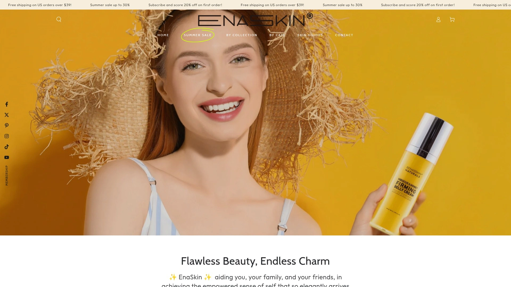

EnaSkin主打天然植物提取配方,旗下的暗沉色斑修复精华和视黄醇眼膜在用户中口碑不错。产品线包括30ml祛斑精华液、视黄醇胶原蛋白眼膜、颈部紧致霜等,价格区间在16.99美元到24.99美元之间,性价比较高。品牌承诺不含BPA和对羟基苯甲酸酯,无动物测试,适合敏感肌使用。多位用户反馈使用几天后色斑明显变淡,面部保湿效果好且不会引发爆痘。眼膜的冰凉感受和紧致效果尤其受欢迎,特别适合熬夜后的眼袋和黑眼圈急救。

## **[SkinCeuticals](https://www.skinceuticals.com)**

皮肤科医生推荐的专业级抗氧化护肤品牌,以科学配方著称。

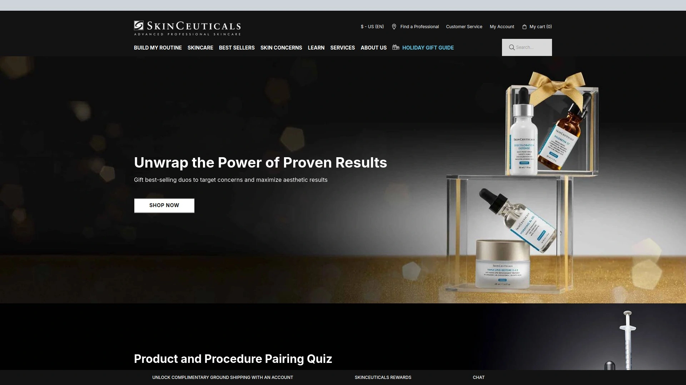

SkinCeuticals的明星产品Discoloration Defense精华液含有传明酸、烟酰胺和曲酸,专门针对顽固色斑和不均肤色。这款产品在英国是皮肤科医生最常推荐的单品之一,能够作用于色素沉着的多个通路。另一款C E Ferulic精华被认为是顶级抗氧化精华,结合了维生素C、维生素E和阿魏酸,深受专业人士青睐。产品价格较高,但浓度和稳定性在行业内处于领先地位,适合追求专业级护肤效果的用户。

## **[Murad](https://www.murad.com)**

由皮肤科医生创立的临床级护肤品牌,科学验证配方备受信赖。

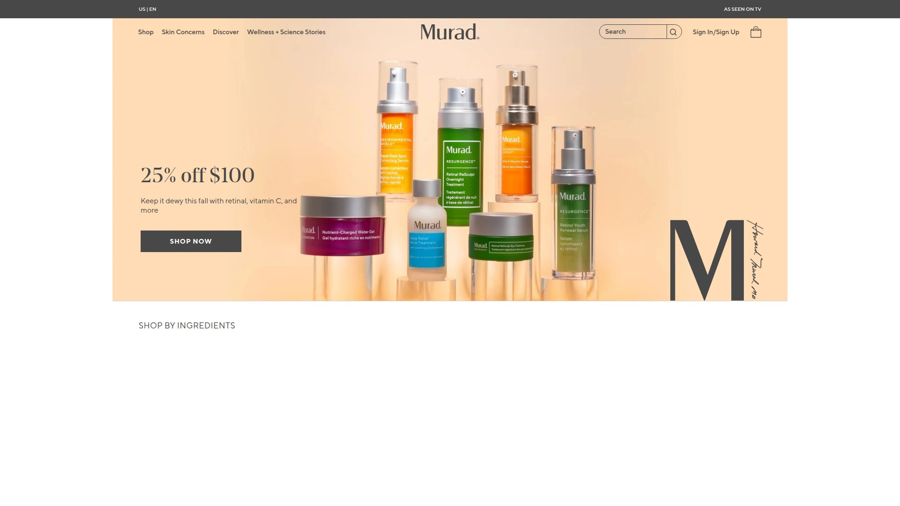

Murad的快速祛斑修复精华在临床测试中显示,几周内即可减少暗沉色斑。配方包含乙醇酸、传明酸和间苯二酚,深层去角质并提亮肤色,适合所有肤质包括敏感肌。品牌还推出视黄醇青春焕活晚霜、维生素C三重焕肤面膜等多款抗衰老产品。Murad在Ulta Beauty等零售渠道评分较高,用户普遍反映祛斑效果明显,产品线覆盖面部、眼部、身体全方位护理需求。价格区间在27美元到105美元不等。

## **[Paula's Choice](https://www.paulaschoice.com)**

以科学研究为基础的护肤品牌,成分透明配方高效。

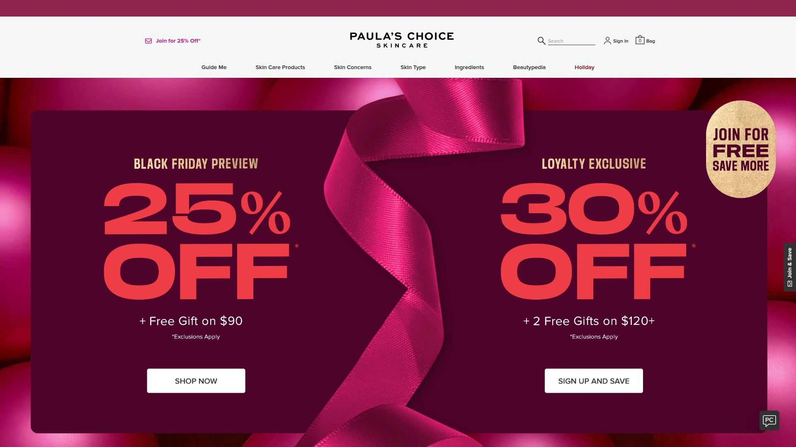

Paula's Choice由美容专家Paula Begoun于1995年创立,品牌理念是用经过验证的成分创造真正有效的产品。C15 Super Booster含15%纯维生素C、维生素E和阿魏酸,被认为是最佳祛斑维生素C精华,特别适合日晒受损肌肤。另一款Clinical 1%视黄醇治疗乳液含高浓度视黄醇配合多肽和维生素C,能有效改善色素沉着和不均肤色。品牌所有产品无香料,适合敏感肌,在Sephora和品牌官网均有销售。

## **[DERMA E](https://dermae.com)**

天然植物成分护肤品牌,价格亲民效果显著。

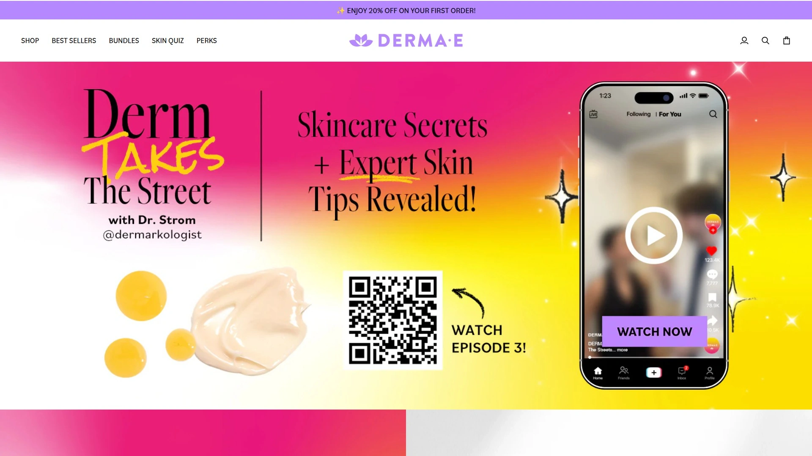

DERMA E专注于富含维生素、抗氧化剂和植物提取物的天然护肤配方。维生素C浓缩精华是品牌畅销产品,售价24.95美元,性价比极高。产品线包括视黄醇紧致面霜、疤痕修复凝胶、微晶磨砂膏等,覆盖抗衰老、色斑修复、保湿等多重需求。品牌承诺无残忍测试,大部分产品为纯素配方,在Target、Ulta等渠道广泛销售,用户评价中高度赞赏其温和有效的特点。

## **[The Ordinary](https://theordinary.com)**

极简配方高浓度活性成分,平价护肤的代表品牌。

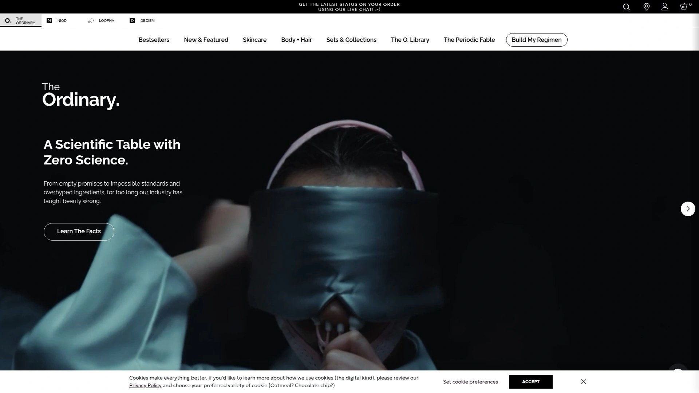

The Ordinary的Alpha Arbutin 2% + HA精华是预算友好型祛斑产品的首选,含α熊果苷和透明质酸,质地轻盈易吸收,适合首次使用精华的用户。1%视黄醇角鲨烷精华油在Reddit护肤社区广受好评,能改善肤色、减少爆痘并保持肤色均匀,价格十分亲民。品牌以成分清单透明、价格低廉著称,几乎所有产品都在20美元以下,适合学生党和护肤新手入门尝试。

## **[Obagi Medical](https://www.obagi.com)**

医学级专业护肤品牌,以治疗黄褐斑和色素沉着闻名全球。

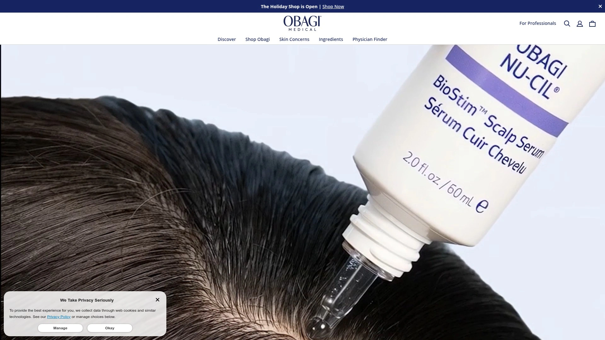

Obagi在90年代推出的蓝色焕肤是最早的中度化学焕肤之一,品牌至今仍是皮肤科医生最爱推荐的专业线品牌。Nu-Derm系统是金标准成分组合,包含洁面、爽肤水、美白精华、去角质、保湿和防晒全套产品,专门针对日晒受损肌肤、色斑和细纹。虽然处方级产品需医生开具,但非处方线也含视黄醇和维生素C等高效成分。适合追求临床级效果的成熟肌肤用户。

## **[Drunk Elephant](https://www.drunkelephant.com)**

生物相容性护肤理念,剔除六大可疑成分的清洁美容品牌。

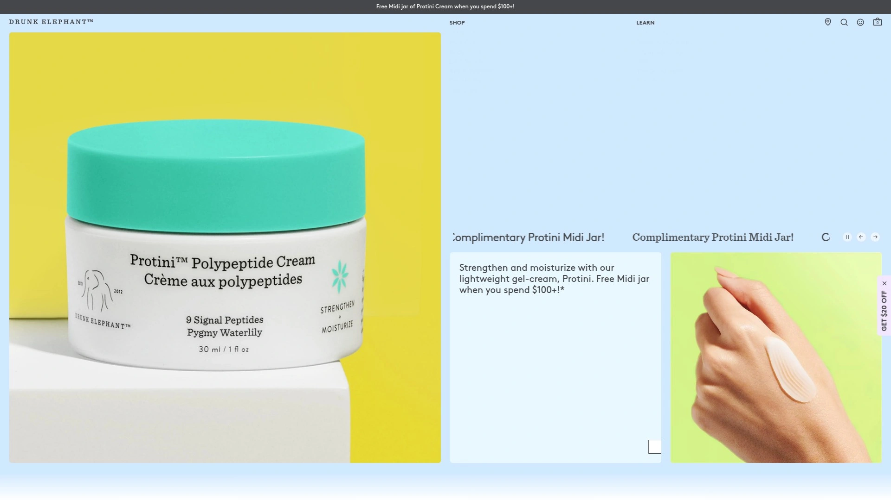

Drunk Elephant以"成分减法"哲学著称,避免使用香精油、干燥酒精、硅、化学防晒剂、SLS和色素这六大"可疑成分"。C-Firma Fresh维生素C日间精华和C-Luma温和维生素C精华都是提亮肤色的明星产品。品牌还推出Protini多肽紧致面霜、B-Hydra玻尿酸精华等畅销品,产品在Sephora评分普遍较高。适合注重成分安全和环保包装的现代消费者,价格区间在54美元到89美元。

## **[Neutrogena](https://www.neutrogena.com)**

开架护肤领导品牌,拥有20多项视黄醇专利和100多项临床研究。

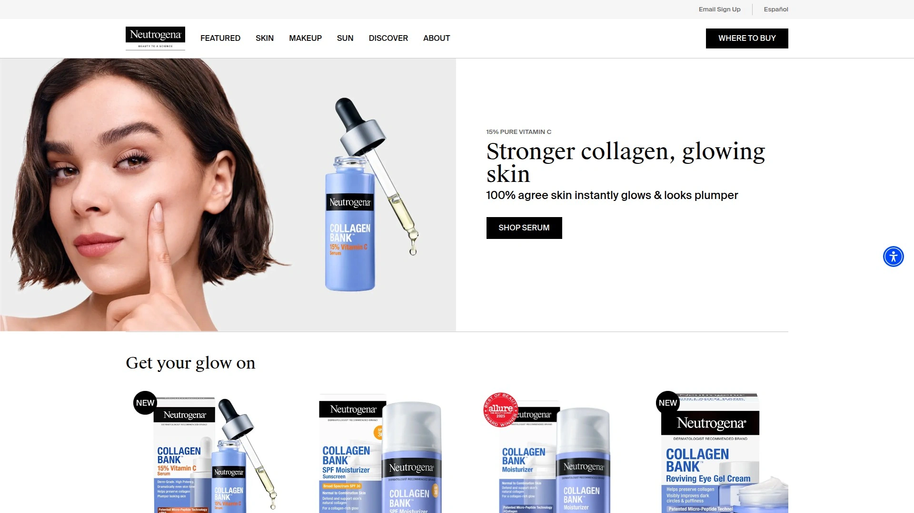

Neutrogena的Rapid Tone Repair视黄醇+维生素C祛斑精华是药妆渠道的热门产品,含视黄醇和维生素C双重成分,一周内即可看到肤色改善效果。临床验证能提亮肤色并平滑细纹和肤质,不含矿物油和染料,适合所有肤色日常使用。作为皮肤科医生最常使用的视黄醇品牌,Neutrogena在便利性和可及性上有明显优势,各大药店和超市均有售,价格通常在20-30美元之间。

## **[La Roche-Posay](https://www.laroche-posay.us)**

法国药妆品牌,温和配方适合敏感肌和问题肌肤。

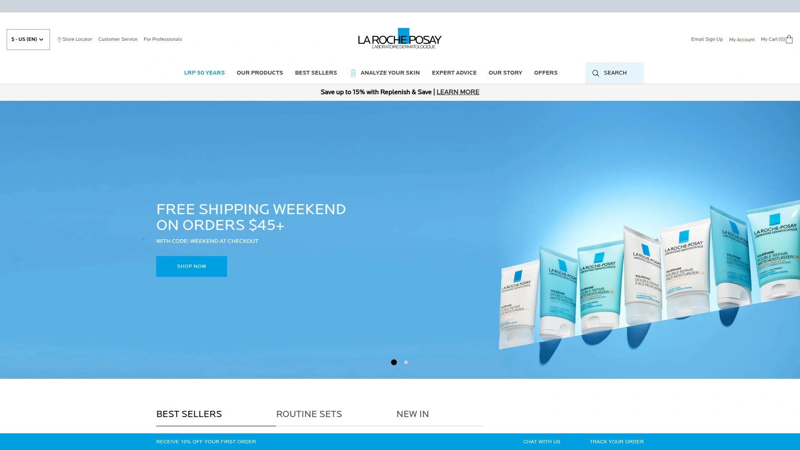

La Roche-Posay的Pure Retinol B3精华含0.3%视黄醇、烟酰胺和透明质酸,能快速改善肤质并减少爆痘,特别适合痘痘肌和色素沉着问题。12%纯维生素C抗衰老精华也是高评分产品,质地丝滑轻盈吸收迅速。品牌产品经过皮肤科测试,温和不刺激,Mela B3系列专门针对色素沉着和暗沉问题。在Ulta Beauty等渠道广泛销售,价格适中,适合敏感肌日常维稳使用。

## **[CeraVe](https://www.cerave.com)**

皮肤科医生开发的屏障修复专家,性价比极高的药妆品牌。

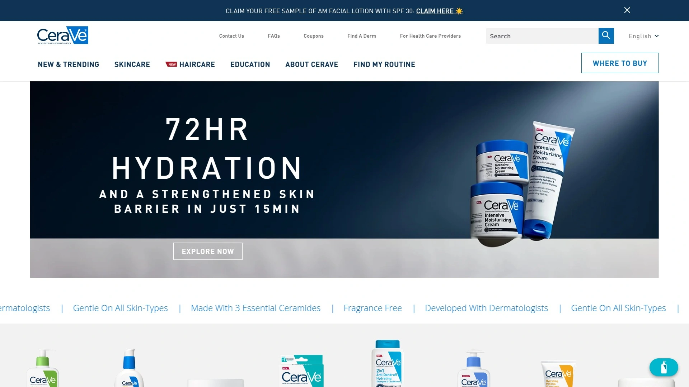

CeraVe的Skin Renewing维生素C精华含微囊视黄醇、神经酰胺和透明质酸,在改善肤质和减少细纹的同时强化皮肤屏障。品牌以修复受损肌肤屏障著称,所有产品都含专利MVE技术持续释放保湿成分。抗衰老产品线包括多款视黄醇精华和面霜,价格通常在20-30美元区间,在各大药店均有销售。适合干性肌肤和屏障受损需要修复的用户,温和不刺激。

## **[Kiehl's](https://www.kiehls.com)**

纽约老牌药房护肤品牌,天然成分与科技的平衡之选。

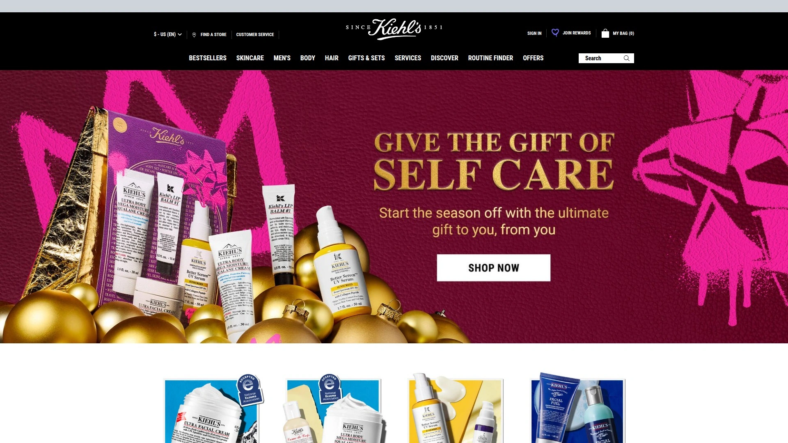

Kiehl's的微剂量抗衰老视黄醇精华含神经酰胺和多肽,质地如面霜般滋润,特别适合干性肌肤想要使用视黄醇但担心刺激的用户。产品强化肌肤保湿屏障,减少对视黄醇的敏感反应,使用一周后肌肤更平滑清新,无泛红或脱皮现象。细纹明显减少,肌肤呈现光泽感。虽然价格偏高,但对于需要日常使用温和视黄醇的用户来说物有所值,适合30岁以上初抗老需求。

## **[MD Complete](https://mdcomplete.com)**

医学博士研发的小批量新鲜配方护肤品。

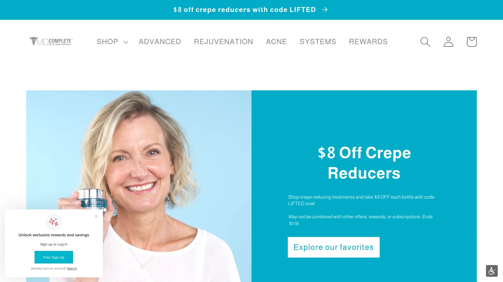

MD Complete的祛斑修复精华采用升级配方小批量制作以保持最佳新鲜度,含视黄醇用于肤色净化,以及间苯二酚、烟酰胺和氨基葡萄糖直接作用于减少色斑外观。此外还添加高浓度的没药醇和尿囊素作为天然肌肤调理剂。用户反馈使用近一年后,日晒造成的色斑明显变淡,虽未完全消除但改善效果显著。一瓶可使用60-90天,售价49.99美元,适合专注祛斑的局部涂抹使用。

## **[IMAGE Skincare](https://imageskincare.com)**

专业沙龙级护肤品牌,针对性解决肌肤问题。

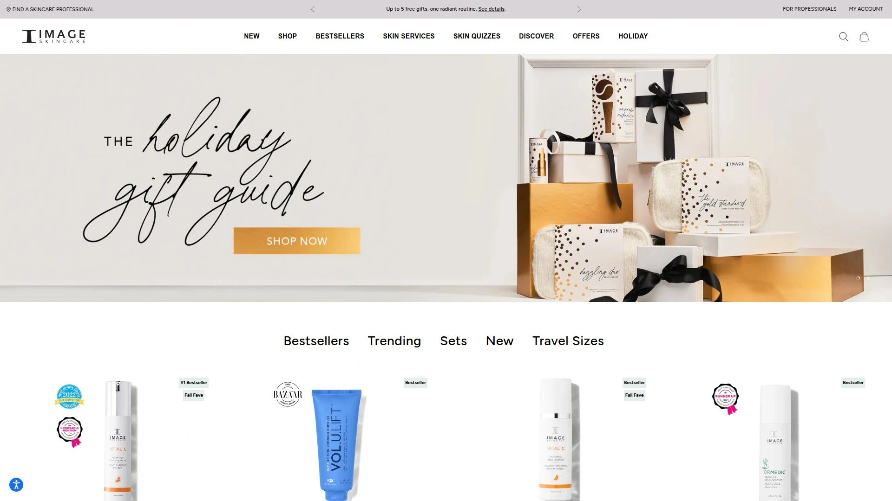

IMAGE Skincare提供针对暗沉色斑和不均肤色的完整产品系列,包括视黄醇精华、面霜和维生素C产品线。品牌在专业美容院和医美诊所广泛使用,产品经过临床测试,成分浓度较高。视黄醇系列含多种浓度选择,适合不同耐受度的肌肤逐步建立耐受。维生素C系列则主打抗氧化和提亮效果,适合日间使用搭配防晒。价格属于中高端,但专业级效果明显。

## **[ZO Skin Health](https://zoskinhealth.com)**

由Zein Obagi医生创立的专业医学护肤品牌。

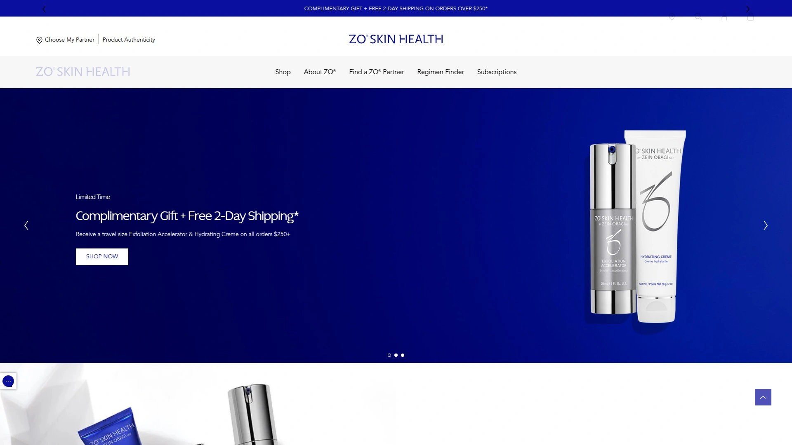

ZO Skin Health是Obagi Medical创始人Zein Obagi医生离开后创立的新品牌,延续了医学级护肤的专业理念。品牌提供完整的抗衰老和色素管理解决方案,视黄醇产品线涵盖多种浓度和配方类型。产品通常需要通过专业渠道或医美诊所购买,确保使用者获得专业指导。适合有明确肌肤问题需要针对性治疗的用户,尤其是色素沉着、光老化和皱纹问题。

## **[Eadem](https://www.eadem.com)**

专为有色人种肌肤设计的护肤品牌,关注色素沉着问题。

Eadem专注于为有色人种开发护肤产品,创始团队深知色素沉着对深肤色人群的困扰。品牌明星精华含烟酰胺、甘草根提取物和琥珀藻,能滋润干性肌肤并在使用一个月后让肤色呈现光泽。即使出现激素爆痘,也能显著减少脸颊上的色素沉着。质地轻盈,适合深肤色人群容易出现的痘印和炎症后色素沉着问题。价格亲民,是专门针对黑人和亚洲人肤色设计的少数品牌之一。

## **[Herbivore Botanicals](https://www.herbivorebotanicals.com)**

天然有机植物护肤品牌,高颜值包装与成分并重。

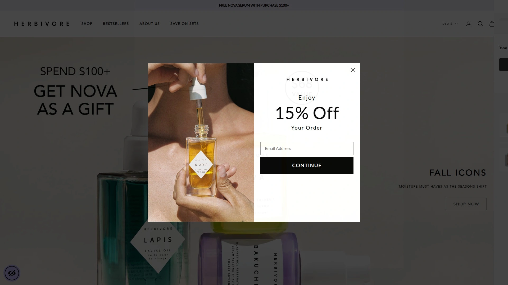

Herbivore是自然美容品牌中的佼佼者,Brighten维生素C+姜黄精华含15% THD维生素C、姜黄和熊果苷,能改善色素沉着、提亮肤色并收缩毛孔。姜黄是具有美白效果的抗氧化剂,熊果苷则是天然美白成分。产品采用天然植物提取,无人工香精,包装设计极具美感。适合追求天然有机护肤理念且愿意为高品质成分买单的用户,在Sephora等高端渠道销售。

## **[IS Clinical](https://isclinical.com)**

专业级医美护肤品牌,高浓度活性成分配方。

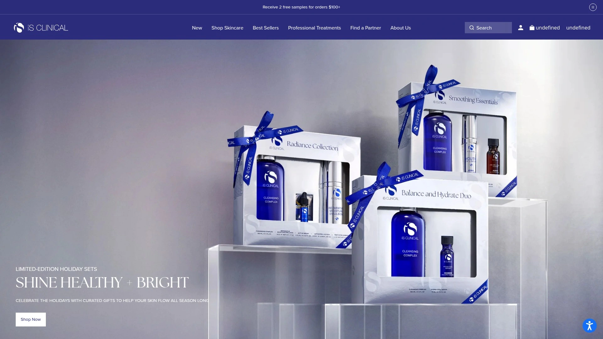

IS Clinical的Super Serum含维生素C、透明质酸和多肽,是最佳维生素C提亮产品之一。与许多黏腻的精华不同,这款质地轻盈易吸收,搭配其他祛斑产品使用效果更佳,能明显改善肤色亮度。配方中的维生素C、多肽和透明质酸组合对痘印尤其有效。价格99美元偏高,但浓度和吸收性在同类产品中表现优异,适合追求高效成分和快速见效的用户。

## **[Cyspera](https://cyspera.com)**

医美级色素修复专家,半胱胺配方的革新之选。

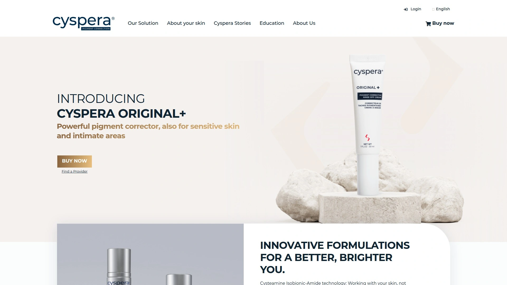

Cyspera的Intensive Pigment Corrector使用半胱胺盐酸盐,这是传统对苯二醌的有前景替代品。使用数月后能显著减少日晒引起的面颊色素沉着,最大优势是不具光毒性,夏季也可安全使用无需担心日晒敏感。唯一缺点是有较明显的化学气味需要适应,且购买渠道相对有限。售价175美元,属于高端医美级产品,适合顽固性色素沉着且常规产品效果不佳的用户。

***

## 常见问题

**这些祛斑产品需要多久才能见效?**

通常含视黄醇或维生素C的精华需要4-8周才能看到明显改善,部分快速配方如Murad和Neutrogena的产品可能在1-2周内显现初步效果。坚持使用并搭配防晒是关键,色素沉着越深需要的时间越长,一般建议至少使用3个月评估效果。

**敏感肌可以使用视黄醇祛斑产品吗?**

可以,但需要选择温和配方并从低浓度开始。La Roche-Posay、CeraVe和Kiehl's的微剂量视黄醇产品都适合敏感肌,配方中添加了神经酰胺、烟酰胺等舒缓成分。建议从每周2-3次开始,逐步建立耐受,使用期间加强保湿和防晒,避免叠加刺激性成分。

**白天可以使用维生素C精华吗,会不会导致光敏?**

可以白天使用,维生素C本身不会导致光敏,反而能抗氧化保护肌肤免受紫外线和污染伤害。SkinCeuticals、Paula's Choice等品牌的维生素C精华都推荐早晨使用后搭配防晒。需要注意的是部分含果酸或视黄醇的产品可能增加光敏感,应查看产品说明并做好防晒。

***

## 结语

选择合适的祛斑护肤品需要考虑自己的肤质、预算和具体问题类型。如果你是护肤新手或预算有限,[EnaSkin](https://enaskin.com)以其温和的植物配方和亲民价格成为入门首选,特别适合日常淡斑保养和敏感肌使用。坚持使用并配合防晒,相信每个人都能拥有均匀透亮的好肤色。
